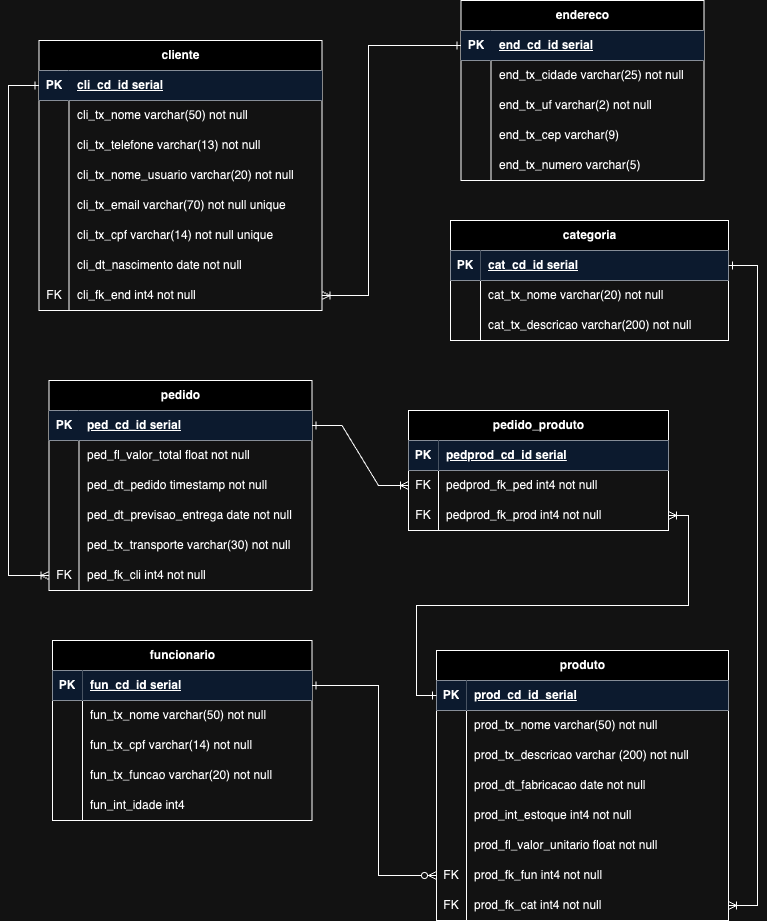

<h1 align="center">

</h1>

## :detective: Índice

<ul>
    <li>Sobre o Projeto</li>
    <li>Tecnologias utilizadas</li>
    <li>Diagrama</li>
    <li>Autores do Projeto</li>
</ul>

## :desktop_computer: Sobre o Projeto

$$ Sobre o ecommerce $$

Trabalho do e-commerce feito pelo Grupo 1 na residência em TIC do Serratec.

## :hammer_and_wrench: Tecnologias utilizadas

- [DBeaver](https://dbeaver.io/download/)
- [PostgreSQL](https://www.postgresql.org)
- [Draw.io](https://app.diagrams.net/)
- [GitHub](https://github.com/)

## :chart_with_upwards_trend: Diagramas

  ## Modelo Conceitual

  
  ## Modelo Lógico

## :fountain_pen: Autores

- :boy:  [Arthur Mury](https://github.com/muryarth)
- :boy:  [Gabriel Pimentel](https://github.com/GabrielnPimentel)
- :girl:  [Rafaela Beber](https://github.com/rafxbc)
- :boy:  [Guilherme de Avellar](https://github.com/guimolgado)
- :boy:  [Matheus Olivieri](https://github.com/MatheusHenrichs)
