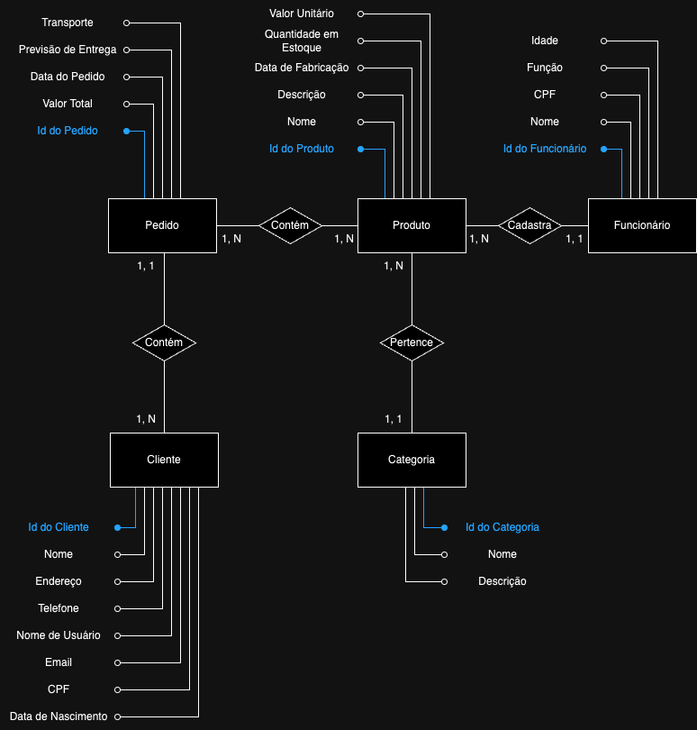

<h1 align="center">
    
</h1>

## :detective:Índice

<ul>
    <li>Sobre o Projeto</li>
    <li>Tecnologias utilizadas</li>
    <li>Diagrama</li>
    <li>Autores do Projeto</li>
</ul>

* Sobre o Projeto
* Tecnologias utilizadas
* Diagrama
* Autores do Projeto

## :desktop_computer:Sobre o Projeto

$$ Sobre o ecommerce $$

## :hammer_and_wrench: Tecnologias utilizadas

- [DBeaver](https://dbeaver.io/download/)
- [PostgreSQL](https://www.postgresql.org)
- [Draw.io](https://app.diagrams.net/)
- [GitHub](https://github.com/)

## :chart_with_upwards_trend: Diagramas

  ## Modelo Conceitual
    
  
  ## Modelo Lógico
    

## Autores

- :boy:[$$ nome do membro $$]($$ link do github do membro $$)
- :girl:[$$ nome do membro $$]($$ link do github do membro $$)